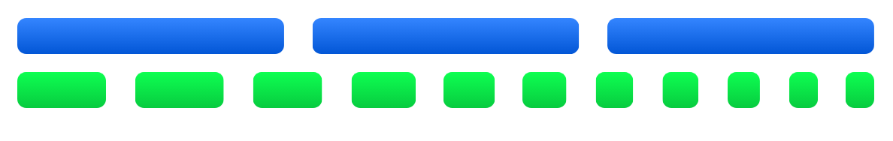

<br>
<h1 align="center">
  🎥 PixiJS Interpolated Ticker
  <br>
  
<br>
<br>
</h1>
<br>
<br>

<p align="center">
  ⚡️ Fixed update loop, unlimited render FPS &ndash; seamless, high-performance frame interpolator for PixiJS
</p>
<br>

<br>

<p>
  <a href="https://www.npmjs.com/package/pixijs-interpolated-ticker"></a>
  <a href="https://github.com/reececomo/pixijs-interpolated-ticker/blob/main/LICENSE"></a>
  <a href="https://bundlephobia.com/package/pixijs-interpolated-ticker"></a>
  <a href="https://github.com/reececomo/pixijs-interpolated-ticker/actions/workflows/tests.yml"></a>
  <a href="https://www.npmjs.com/package/pixijs-interpolated-ticker"></a>
</p>

<table>
<tbody>
<tr>
<td>🔮 Simple, drop-in API</td>
<td>✨ Supports PixiJS v6, v7, v8+</td>
</tr>
<tr>
<td>✅ Plugin compatible</td>
<td>💪 Configurable, with sensible defaults</td>
</tr>
<tr>
<td>🤏 Tiny (&lt;2kB)</td>
<td>🍃 No dependencies, tree-shakeable</td>
</tr>
</tbody>
</table>

## Sample Usage

*Create and configure an update loop.*

```ts
// define an update loop (default: 60Hz)
const mainLoop = new InterpolatedTicker({ app })

mainLoop.update = () => {
  // changes made here will be rendered at the
  // current refresh rate is (e.g. 30Hz, 144Hz)
}

mainLoop.start()
```

## Getting Started

### 💿 Installation

```sh
# npm
npm install pixijs-interpolated-ticker -D

# yarn
yarn add pixijs-interpolated-ticker --dev
```

### Concepts

InterpolatedTicker separates the update loop into a fixed-interval **update** frame, and a variable-interval **render** frame.

The **update** and **render** loops are independent, and can run at different speeds - i.e. a 30Hz update loop could be rendered at 144 FPS, just as a 128Hz update loop could be rendered at 30 FPS.

During an **update** frame, the InterpolatedTicker hydrates its internal buffer with the true `x`, `y`, `scale`, `rotation`, and `alpha` for stage containers. Then during each **render** frame, those stage containers are rendered to the framebuffer with interpolated values.

> [!IMPORTANT]
> **Interpolation:** The rendered values are always slightly _behind_ the true current value, by up to one frame.

## Configuration

### Ticker Options

*Configuring your interpolation ticker.*

```ts
const mainLoop = new InterpolationTicker({
  app: myApplication,

  // how often to trigger update loop (default: 1000/60)
  updateIntervalMs: 1000 / 30,

  // initial # of containers to pre-allocate memory for (default: 500)
  initialCapacity: 10000, 
})

// set the target frequency of the update loop
mainLoop.updateIntervalMs = 1000 / 30;

// modify the frequency of the update loop (relative to updateIntervalMs)
mainLoop.speed = 1.5

// limit the render frequency, -1 is unlimited (default: -1)
mainLoop.maxRenderFPS = 60

// limit render skips - if rendering is interrupted for any
// reason - e.g. the window loses focus - then this will
// limit the maximum number of "catch-up" frames.
mainLoop.maxUpdatesPerRender = 10;

// enable/disable interpolation overall
mainLoop.interpolation = false;

// set upper limits for interpolation.
// any changes between update frames larger than these are discarded
// and values are snapped.
mainLoop.autoLimitAlpha = 0.1; // default: 0.5
mainLoop.autoLimitPosition = 250; // default: 100
mainLoop.autoLimitRotation = Math.PI; // default: Math.PI / 4 (45°)
mainLoop.autoLimitScale = 2; // default: 1.0

// set the default logic for opt-in/opt-out containers
mainLoop.getDefaultInterpolation = ( container ): boolean => {
  return !(container instanceof ParticleContainer);
}

//
// lifecycle hooks:
//

mainLoop.preRender = ( deltaTimeMs ) => {
  // triggered at the start of a render frame, immediately
  // after any update frames have been processed.
  // container values are their true values.
}
mainLoop.onRender = ( deltaTimeMs ) => {
  // triggered during a render frame, prior to writing the framebuffer.
  // container values are their interpolated values.
  // changes to values made here will affect the current render.
}
mainLoop.postRender = ( deltaTimeMs ) => {
  // triggered at the end of a render frame.
  // container values are their true values.
}

mainLoop.evalStart = ( startTime ) => {
  // triggered at the start of each evaluation cycle, prior to
  // any update or render frames being processed.
}
mainLoop.evalEnd = ( startTime ) => {
  // triggered at the end of each evaluation cycle, after all
  // update and render frames have been processed.
}
```

> [!TIP]
> The internal buffer automatically resizes as-needed, and is pretty fast even for large scenes. You may optionally set the  `initialCapacity` manually too.

### Container Options

Containers are extended with a few optional properties to make it easy to configure interpolation.

Interpolation is opt-out for stage items, and disabling interpolation for a container will also disable it for all descendants.

| Property | Description |
| :----- | :------ |
| `interpolation` | Whether interpolation is explicitly enabled or disabled for this container. The default behavior for all containers is `true`. |
| `interpolatedChildren` | An array of child containers to include in interpolation. When not set, `children` is used. |
| `interpolationWraparound` | If set, position will smoothly wraparound the given ranges. |

```ts
// disable interpolation for a container
// (and all of its descendants):
const sprite = new Sprite()
sprite.interpolation = false;

// allow a container's position to wraparound smoothly:
const background = new Sprite()
background.interpolationWraparound = {
  xRange: 1000,
  yRange: 2000
}

// explicitly set which children may be interpolated
const parent = new Container()
const childA = new Container()
const childB = new Container()
parent.addChild( childA, childB )
parent.interpolatedChildren = [ childB ];
```

## Credits

PixiJS InterpolatedTicker is a spiritual successor to [kittykatattack/smoothie](https://github.com/kittykatattack/smoothie).
